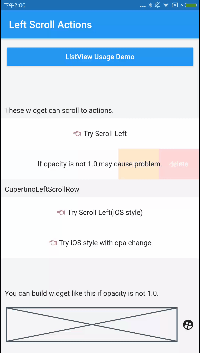

# left_scroll_actions

A useful left scroll actions widget like WeChat.

一款仿微信效果的 Flutter 左滑菜单插件。现在支持iOS的展开与弹性效果。  

很轻松的打开关闭指定组件。
或者在同一个列表内通过tag实现联动关闭（打开一个关闭其他）。   



## Install

Add this to your package's pubspec.yaml file:
把如下字段加入你的`pubspec.yaml`文件：

```yaml
dependencies:
  flutter:
    sdk: flutter
  // 添加下面这一行。 Add this row.
  left_scroll_actions: any
```

然后运行`flutter packages get`即可

## Usage


### CupertinoLeftScroll (1.4.0)

```dart
  CupertinoLeftScroll(
    // important, each Row must have different key.
    // DO NOT use '$index' as Key! Use id or title.
    key: Key('TODO: your key'),
    // left scroll widget will auto close while the other widget is opened and has same closeTag.
    // 当另一个有相同closeTag的组件打开时，其他有着相同closeTag的组件会自动关闭.
    closeTag: LeftScrollCloseTag('TODO: your tag'),
    buttonWidth: 80,
    child: Container(
      height: 60,
      color: Colors.white,
      alignment: Alignment.center,
      child: Text('👈 Try Scroll Left'),
    ),
    buttons: <Widget>[
      LeftScrollItem(
        text: 'edit',
        color: Colors.orange,
        onTap: () {
          print('edit');
        },
      ),
      LeftScrollItem(
        text: 'delete',
        color: Colors.red,
        onTap: () {
          print('delete');
        },
      ),
    ],
    onTap: () {
      print('tap row');
    },
  );
```

### LeftScroll

You can use this widget as same as `CupertinoLeftScroll`.
Custom define you slide animation by implements `onScroll` function.

### 弹性 (1.5.0）

1. 设置`CupertinoLeftScroll`的`bounce`参数为`true`，即可获得弹性效果
2. 通过`CupertinoLeftScroll`的`bounceStyle`参数控制弹性效果

### 左滑联动列表（1.3.0）

1. 对于提供同一个`LeftScrollCloseTag`的LeftScroll组件，可以在一个打开时，关闭其他组件
2. 想要关闭特定的行，只需使用以下代码
```dart
// 找到对应tag与key的row状态，改变状态即可
LeftScrollGlobalListener.instance.targetStatus(tag,key) = false;
```

### 左滑列表（1.2.0新增）（已过期）
```dart
/// 已过期
LeftScrollList.builder(
  /// Deprecated! Do not use this widget anymore.
  /// Instead, you can add [LeftScrollCloseTag] property to [LeftScroll] or [CupertinoLeftScroll] widget.
);
```

See:


## Getting Started

This project is a starting point for a Dart
[package](https://flutter.dev/developing-packages/),
a library module containing code that can be shared easily across
multiple Flutter or Dart projects.

For help getting started with Flutter, view our
[online documentation](https://flutter.dev/docs), which offers tutorials,
samples, guidance on mobile development, and a full API reference.
